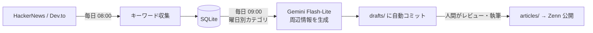

## はじめに

「記事を書きたいけど、ネタ出しと下調べが重い」

技術記事を書こうとすると、意外と最初の一歩が重いです。
何を書くかを決める。周辺情報を調べる。構成を考える。参考になりそうな情報を集める。

本文を書く前に、すでにけっこう疲れます。

この問題を解決するために、Claude Code と対話しながら、Zenn 記事の下書きを自動で蓄積するパイプラインを作りました。

かかった時間は実質半日ほどです。

この記事では、その構成と、AI コーディングエージェントと一緒に作って分かったことをまとめます。

## 何を作ったか

作ったのは、Zenn 記事の「本文」ではなく、記事を書く前のたたき台を自動で貯める仕組みです。

ざっくり言うと、外部 API から話題を集め、SQLite で在庫管理し、Gemini で下書き素材を生成して、GitHub Actions で毎日 commit する構成です。



やっていることはシンプルです。

- HackerNews と Dev.to から直近の話題を収集する
- キーワードを SQLite に保存する
- カテゴリと used フラグで在庫管理する
- 曜日ごとにカテゴリを切り替えて、未使用キーワードから最大5件を下書き化する
- Gemini 2.5 Flash-Lite で背景・関連キーワード・参考リソース・構成案を生成する
- 生成した Markdown を `drafts/` に保存し、自動で commit & push する

ポイントは、記事本文までは書かせないことです。

生成するのは、あくまで「調べもののたたき台」まで。
本文は人間が書きます。

この線引きが、運用してみるとかなり重要でした。

## キーワード収集

キーワード収集元は、まず HackerNews と Dev.to にしました。

HackerNews は Algolia API、Dev.to は公式 API から取得しています。
どちらも認証不要で使えるため、個人用の小さなパイプラインにはちょうどよいです。

最初から大きな収集基盤を作るのではなく、まずは「技術系の話題が毎日少しずつ入ってくる」状態を作ることを優先しました。

## SQLite で在庫管理する

DB は SQLite です。

個人用なので、最初から DB サーバーを立てる必要はありません。
SQLite ファイルごと git 管理すれば、記事ネタの在庫も履歴として残せます。

スキーマはこれだけです。

```sql
CREATE TABLE keywords (
  id INTEGER PRIMARY KEY AUTOINCREMENT,
  source TEXT NOT NULL,        -- hackernews / devto / 手動投入
  keyword TEXT NOT NULL,
  category TEXT NOT NULL,      -- 曜日ローテの単位
  used INTEGER DEFAULT 0,      -- 下書き化済みフラグ
  fetched_at TEXT DEFAULT (datetime('now'))
);

CREATE TABLE themes (
  id INTEGER PRIMARY KEY AUTOINCREMENT,
  keyword_id INTEGER REFERENCES keywords(id),
  title TEXT NOT NULL,
  slug TEXT NOT NULL,
  status TEXT DEFAULT 'pending',  -- pending / drafted / published
  created_at TEXT DEFAULT (datetime('now'))
);
```

やりたいことは、「記事ネタを重複なく貯める」ことです。

そのために、キーワードにはカテゴリを付け、下書き化したものには `used` フラグを立てます。
これで、同じネタを何度も使ってしまうことを防げます。

古いキーワードは月1回の purge ジョブで削除するようにしました。

## 曜日ローテーション

毎日同じカテゴリの記事ネタばかり生成されると偏ります。

そこで、曜日ごとに担当カテゴリを分けました。

たとえば、

- 月曜：Tech
- 火曜：AI
- 水曜：キャリア
- 木曜：開発プロセス
- 金曜：プロダクト
- 土日：軽めのテーマ

のようなイメージです。

その日のカテゴリに合う未使用キーワードを SQLite から取り出し、最大5件だけ下書き化します。

数を絞っているのは、生成量を増やしすぎても人間が見なくなるからです。
在庫は欲しいけど、在庫の山に埋もれたら本末転倒です。

## Gemini 2.5 Flash-Lite で周辺情報を生成する

生成モデルには Gemini 2.5 Flash-Lite を使いました。

生成させる内容は、本文ではなく次のような周辺情報です。

- 背景
- 関連キーワード
- 参考リソース
- 記事構成案

出力は Markdown にして、`drafts/` ディレクトリへ保存します。

この時点では、まだ公開用の記事ではありません。
あくまで「このテーマで書くなら、こんな方向性がありそう」という素材集です。

## GitHub Actions で全自動化する

パイプラインは GitHub Actions の cron で動かしています。

大まかには、次の2段階です。

1. 毎日 08:00 にキーワードを収集する
2. 毎日 09:00 に未使用キーワードから下書き素材を生成する

生成された Markdown は、そのまま git commit & push します。

ローカルで何かを起動しなくても、朝には `drafts/` に記事の種が増えている状態になります。

これは地味に効きます。

記事を書くときに、ゼロから考えるのではなく、すでに並んでいる下書き候補から選べる。
この差はかなり大きいです。

## Claude Code との進め方

作業はすべて Claude Code との対話で進めました。

流れはこんな感じです。

1. 壁打ち
   「記事の在庫を自動で貯めたい」というふわっとした要望から、対話で要件を固める

2. Issue 化
   決まった仕様を GitHub Issues に登録してもらう
   fetch / generate / pipeline / DB / schedule のように分割

3. 実装
   スクリプトと GitHub Actions ワークフローを生成

4. 実走テストとデバッグ
   実際に動かして、エラーを見せながら原因を潰す

一番効いたのは、実走テストとデバッグの部分です。

コードを生成して終わりではなく、実際のエラーを見せて、原因を特定させ、修正する。
このループがかなり速いです。

自分で全部調べながらやると時間がかかる部分を、Claude Code に「これ何が原因？」と投げられるのが便利でした。

## ハマりどころ

ここからは、実際にハマったところです。

きれいな構成図だけ見ると簡単そうですが、もちろん一発では動きませんでした。

### 1. Vertex AI が 403 で落ちる

最初の実走で、Gemini の呼び出しが 403 で落ちました。

エラーメッセージを Claude Code に貼ると、`BILLING_DISABLED` という reason から、GCP プロジェクトの課金が無効になっていると特定されました。

原因は、請求先アカウントが閉じていたことです。

エラー全文を貼るだけで原因特定まで進むのは、かなり楽でした。
こういう「知っていれば早いけど、知らないと時間が溶ける」系の調査に強いです。

### 2. Workload Identity Federation の権限はリポジトリ単位

GitHub Actions から Vertex AI を呼ぶために、Workload Identity Federation を使っています。

キーレスで認証できるので便利ですが、既存リポジトリで動いていた設定をコピーしただけでは動きませんでした。

原因は、サービスアカウントの `workloadIdentityUser` バインディングがリポジトリ単位で許可されていたことです。

新しいリポジトリから使う場合は、次のような設定が必要になります。

```bash
gcloud iam service-accounts add-iam-policy-binding <SA> \
  --role=roles/iam.workloadIdentityUser \
  --member="principalSet://iam.googleapis.com/<POOL>/attribute.repository/<owner>/<repo>"
```

一度理解すれば単純ですが、初見だと普通にハマります。

### 3. 日本語タイトルは slugify すると消滅する

日本語タイトルを slug に変換するところでもハマりました。

よくある slugify 処理で、次のように記号を除去するとします。

```js
title.replace(/[^\w\s-]/g, "");
```

英語タイトルならそれなりに動きます。

しかし、日本語タイトルに対してこれをやると、ほぼ全部の文字が消えます。
結果として slug が空文字になり、ファイル名が衝突しました。

最終的には、DB の主キーを slug に混ぜることで解決しました。

日本語記事を扱うなら、slug は最初から日本語前提で設計した方がよさそうです。

### 4. LLM は管理用ラベルを本文の意味として読んでしまう

管理用に `Zenn:` という接頭辞をタイトルに付けていたところ、Gemini がそれを本文の意味として解釈してしまいました。

こちらとしては単なる管理ラベルのつもりでした。
しかし、Gemini は「Zenn というプラットフォームについての記事を書くのだ」と解釈し、意図と違う下書きが生成されました。

LLM に渡すデータから、管理用ラベルは剥がす。

地味ですが大事です。

人間にとっては「これは管理用の印」と分かるものでも、LLM は入力された文字列を素直に意味として扱います。

### 5. エラーを握りつぶすと空の成果物ができる

最初の実装では、API エラー時に空文字を返す作りになっていました。

その結果、「本文が空の下書き」が正常終了として commit されました。

生成系のパイプラインでは、失敗はちゃんと失敗として扱った方がいいです。

- API エラー時は throw する
- 空の生成物は保存しない
- キーワードは used にしない
- 次回リトライできる状態で残す

この方が運用が楽です。

「失敗したのに成功扱い」は、後から見るとかなり厄介です。
空の成果物は静かなバグです。静かすぎて逆に怖い。

## コスト設計

生成モデルは Gemini 2.5 Flash-Lite を使っています。

手元の使い方では、1回の下書き生成コストはかなり小さく、1日5件程度なら月数十円〜数百円規模に収まる見込みです。

ただし、生成系のパイプラインは暴走が怖いです。

そのため、月次予算を設定し、予算超過時には課金経路のサービスアカウントを自動で無効化する Cloud Functions も仕込みました。

GCP の予算アラートは、基本的には「通知するだけ」です。
支出を止めるには、止める仕組みを自分で作る必要があります。

個人開発では、ここはけっこう重要だと思っています。

小さな自動化でも、外部 API と生成 AI を組み合わせるなら、止める設計は最初から入れておいた方が安心です。

## AI に本文を書かせなかった理由

今回の仕組みでは、AI に記事本文までは書かせていません。

理由は単純で、そのまま公開できる品質にはならないからです。

試してみると、Flash-Lite クラスの生成物には次のような問題がありました。

- 参考文献に実在しない書籍が混ざる
- 「〇〇大学 〇〇教授」のようなプレースホルダが出る
- キーワード1語だけだと、意図とズレた一般論になる
- それっぽいが、検証が必要な記述が混ざる

つまり、本文としてそのまま公開するには危険です。

一方で、背景・関連キーワード・構成案のたたき台としては十分に使えます。

ここで役割を分けました。

**AI の役割は在庫づくり、人間の役割は執筆と検証。**

この分担にしてから、記事を書き始めるまでの心理的ハードルがかなり下がりました。

ゼロから書き始めるのではなく、すでにある素材を見て、

「これは書けそう」
「これはズレている」
「この切り口なら面白い」

と判断できるようになります。

AI に全部任せるのではなく、人間が判断しやすい状態まで持ってきてもらう。
このくらいの距離感が、今のところ一番使いやすいです。

## 作って分かったこと

今回作ってみて感じたのは、AI コーディングエージェントは「実装そのもの」だけでなく、「実装までの往復」を速くする道具だということです。

特に便利だったのは、次のような場面です。

- ふわっとした要望を仕様に落とす
- 作業単位を Issue に分ける
- GitHub Actions のような細かい設定を書く
- 実行エラーの原因を読む
- 修正方針を出す
- 小さく動くところまで持っていく

昔なら、こういう仕組みを作るには、週末を何回か使う必要があったと思います。

今回は、Claude Code に「ヘルプ」を投げ続けるだけで、半日ほどで動くところまでいけました。

もちろん、AI が勝手に全部決めてくれたわけではありません。

何を作るか。
どこまで自動化するか。
どこで人間が関与するか。
失敗時にどう止めるか。

このあたりを決めたのは人間側です。

むしろ、ツールが強くなるほど、こうした設計判断の比重が上がっていく感覚があります。

## おわりに

今回作ったのは、Zenn 記事を自動投稿する仕組みではありません。

記事を書く前の「ネタ出し」「下調べ」「構成案づくり」を自動化し、人間が書き始めやすくするためのパイプラインです。

小さく作って、動かして、直す。

その相棒として、AI コーディングエージェントはもう実用段階に入っていると感じました。

そして、AI に任せる部分と、人間が握る部分を分けること。
ここを間違えなければ、個人開発でもかなり強い武器になります。
